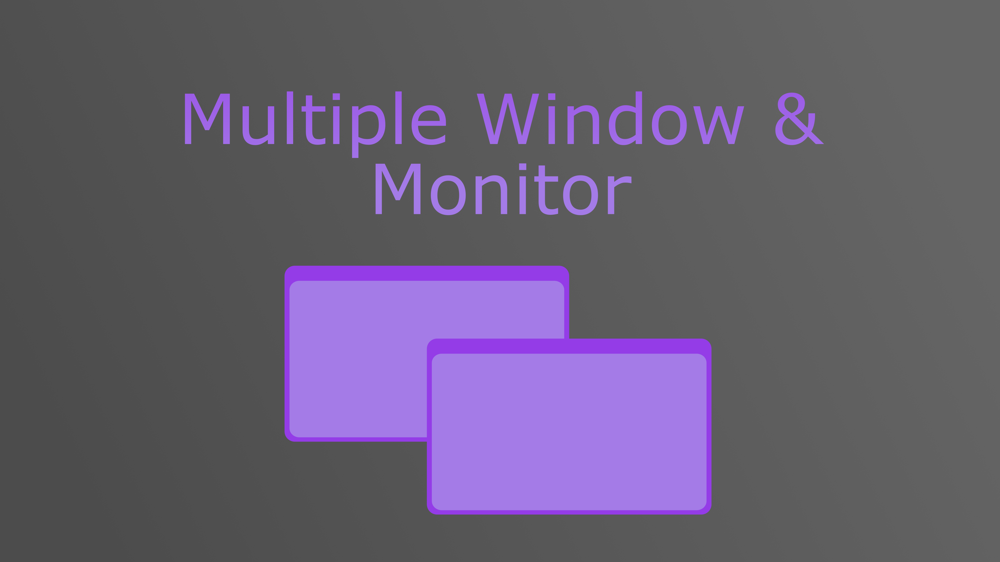
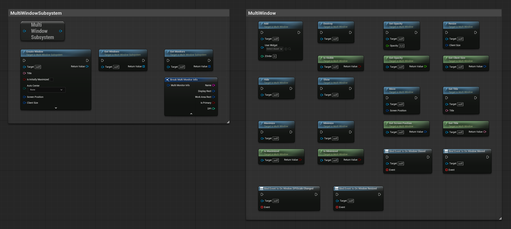
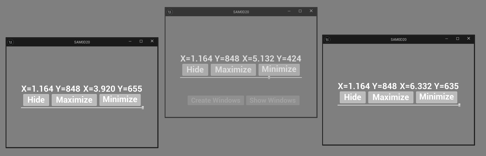

> **Version:** v1.0.0
> **Engine:** UE 5.7
> **Download:** [Fab Store](https://www.fab.com/listings/b42a7670-a29e-466a-9946-aeb8f2637890)

---

## General

The Multi Window & Monitor System plugin lets you create and manage additional native OS windows at runtime, entirely from Blueprint. Each window is a real operating system window - it can be moved, resized, minimized, maximized, and populated with any UMG widget. The plugin also exposes monitor information so windows can be positioned precisely across multiple displays.

The system is built around a World Subsystem, so it is always accessible from any Blueprint in a game world without manual setup. Create a window, add your widgets, and respond to window events - all in a few Blueprint nodes.

Install the plugin from the Fab Store and enable it in your project. Redistribution is strictly prohibited.

---

## Architecture

| Class | Type | Role |
|---|---|---|
| `UMultiWindowSubsystem` | World Subsystem | Creates and tracks all windows for the current world |
| `UMultiWindow` | UObject | Represents a single OS window - control it and bind to its events |
| `EMultiWindowSizingRule` | Enum | Defines how the window handles resizing |
| `EMultiWindowAutoCenter` | Enum | Defines where the window is centered on creation |
| `FMultiMonitorInfo` | Struct | Holds display rect, work area, DPI, and primary flag for one monitor |

---

## Subsystem

`UMultiWindowSubsystem` is a World Subsystem - access it from any Blueprint using `Get Multi Window Subsystem`.

### Functions

| Function | Description |
|---|---|
| `CreateWindow(...)` | Creates a new OS window and returns a `UMultiWindow` reference |
| `GetWindows()` | Returns all currently open windows created by this subsystem |
| `GetMonitors()` | Returns info for every connected monitor |

### CreateWindow Parameters

| Parameter | Type | Description |
|---|---|---|
| `Title` | Text | Window title bar text |
| `bIsInitiallyMaximized` | Bool | Whether the window opens maximized |
| `AutoCenter` | EMultiWindowAutoCenter | Center on none, primary work area, or preferred work area |
| `ScreenPosition` | Vector2D | Initial screen position - used when AutoCenter is None |
| `ClientSize` | Vector2D | Initial size of the window client area |
| `bCreateTitleBar` | Bool | Whether the window has a title bar (advanced) |
| `SizingRule` | EMultiWindowSizingRule | Fixed, autosized, or user-resizable (advanced) |
| `bSupportsMaximize` | Bool | Whether the maximize button is shown (advanced) |
| `bSupportsMinimize` | Bool | Whether the minimize button is shown (advanced) |
| `bHasCloseButton` | Bool | Whether the close button is shown (advanced) |
| `bShowImmediately` | Bool | Whether the window is visible immediately on creation (advanced) |

---

## Window

`UMultiWindow` represents one open OS window. You get a reference from `CreateWindow` and use it to control the window and bind to its events.

### Functions

| Function | Description |
|---|---|
| `Show()` | Makes the window visible |
| `Hide()` | Hides the window without destroying it |
| `Add(UserWidget, ZOrder)` | Adds a UMG widget to the window at the given Z order |
| `Destroy()` | Closes and destroys the window |

### Settings

| Function | Description |
|---|---|
| `SetTitle(Title)` / `GetTitle()` | Get or set the window title bar text |
| `Maximize()` / `IsMaximized()` | Maximize the window or check if it is maximized |
| `Minimize()` / `IsMinimized()` | Minimize the window or check if it is minimized |
| `Move(ScreenPosition)` / `GetScreenPosition()` | Move the window or get its current screen position |
| `Resize(ClientSize)` / `GetClientSize()` | Resize the window or get its current client size |
| `SetOpacity(Opacity)` / `GetOpacity()` | Set or get the window opacity (0.0 - 1.0) |
| `IsVisible()` | Returns whether the window is currently visible |

### Events

| Event | Provides | Description |
|---|---|---|
| `OnWindowClosed` | `UMultiWindow` | Fires when the window is closed |
| `OnWindowMoved` | `UMultiWindow` | Fires when the window is moved |
| `OnWindowResized` | `UMultiWindow` | Fires when the window is resized |
| `OnWindowDPIScaleChanged` | `UMultiWindow` | Fires when the DPI scale of the window changes |

---

## Monitor Info

`GetMonitors()` on the subsystem returns an array of `FMultiMonitorInfo` structs, one per connected display.

| Field | Type | Description |
|---|---|---|
| `Name` | String | Display name of the monitor |
| `DisplayRect` | Box2D | Full pixel bounds of the display |
| `WorkAreaRect` | Box2D | Usable area excluding the OS taskbar |
| `bIsPrimary` | Bool | Whether this is the primary monitor |
| `DPI` | Integer | DPI of the monitor |

Use `WorkAreaRect` to position windows precisely on a specific monitor - for example, center a window on a secondary display by computing its midpoint.

---

## Sizing Rules

| Value | Description |
|---|---|
| `Fixed Size` | Window cannot be resized by the user |
| `Autosized` | Window sizes to fit its content automatically |
| `User Sized` | Window can be freely resized by the user |

## Auto Center

| Value | Description |
|---|---|
| `None` | Window is placed at the provided `ScreenPosition` |
| `Primary Work Area` | Window is centered on the primary monitor's work area |
| `Preferred Work Area` | Window is centered on the preferred monitor's work area |

---

## Demo

A small demo is included showing how to open one window per connected monitor, each centered on its respective display.

The demo Blueprint creates a window for each entry returned by `GetMonitors()`, computes the center of each monitor's work area, positions the window there, and adds a UMG widget to each. It is a practical starting point for any multi-monitor UI layout.

---

## API Reference

### UMultiWindowSubsystem

| Function | Parameters | Description |
|---|---|---|
| `CreateWindow` | `Title`, `bIsInitiallyMaximized`, `AutoCenter`, `ScreenPosition`, `ClientSize`, `bCreateTitleBar`, `SizingRule`, `bSupportsMaximize`, `bSupportsMinimize`, `bHasCloseButton`, `bShowImmediately` | Creates and returns a new OS window |
| `GetWindows` | - | Returns all active windows |
| `GetMonitors` | - | Returns info for all connected monitors |

### UMultiWindow

| Function | Description |
|---|---|
| `Show()` | Makes the window visible |
| `Hide()` | Hides the window |
| `Add(UserWidget, ZOrder)` | Adds a UMG widget to the window |
| `Destroy()` | Closes and destroys the window |
| `SetTitle` / `GetTitle` | Window title bar text |
| `Maximize` / `IsMaximized` | Maximize state |
| `Minimize` / `IsMinimized` | Minimize state |
| `Move` / `GetScreenPosition` | Screen position |
| `Resize` / `GetClientSize` | Client area size |
| `SetOpacity` / `GetOpacity` | Window opacity |
| `IsVisible` | Visibility state |

| Event | Provides | Description |
|---|---|---|
| `OnWindowClosed` | `UMultiWindow` | Window was closed |
| `OnWindowMoved` | `UMultiWindow` | Window was moved |
| `OnWindowResized` | `UMultiWindow` | Window was resized |
| `OnWindowDPIScaleChanged` | `UMultiWindow` | DPI scale changed |

### FMultiMonitorInfo

| Field | Type | Description |
|---|---|---|
| `Name` | String | Monitor display name |
| `DisplayRect` | Box2D | Full pixel bounds |
| `WorkAreaRect` | Box2D | Usable area excluding taskbar |
| `bIsPrimary` | Bool | Primary monitor flag |
| `DPI` | Integer | Monitor DPI |