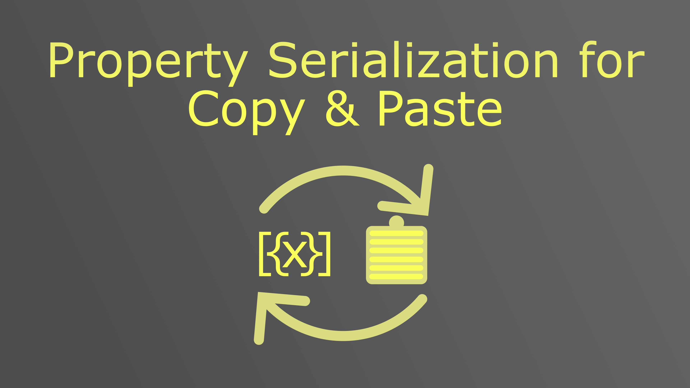
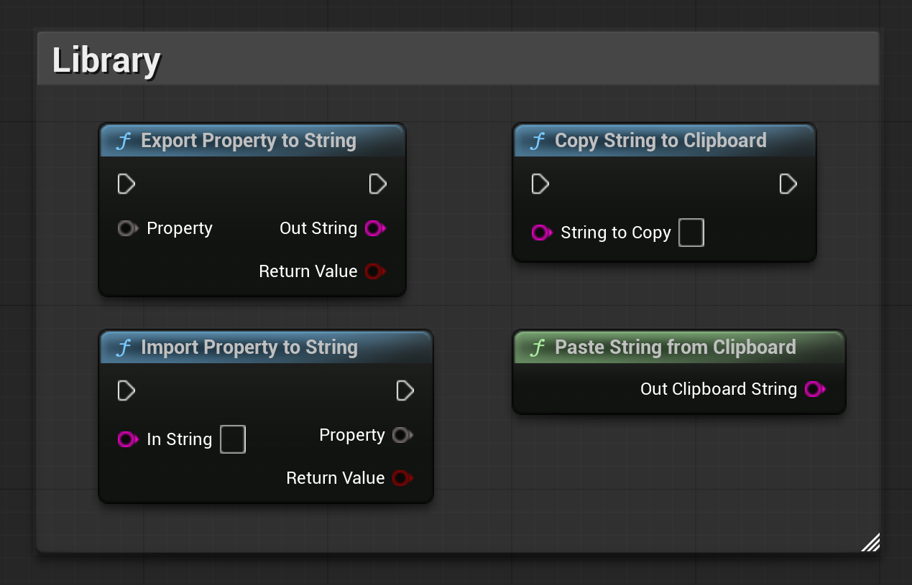

> **Version:** v1.0.0
> **Engine:** UE 5.5 - 5.7
> **Download:** [Fab Store](https://www.fab.com/listings/cff2899f-033f-4ad2-93d8-c670481917c7)

---

## General

The Property Serialization plugin provides two wildcard Blueprint functions that convert any variable, array, map, set, struct etc. to a plain exchangeable string and back. The functions accept any type - primitives, vectors, rotators, custom structs, enums, arrays - without requiring any type-specific handling. Two clipboard helpers are included for copying and pasting those strings directly from Blueprint. The string are fully compatible with Unreal Engine Editor Property Copy & Paste.

Install the plugin from the Fab Store and enable it in your project. Redistribution is strictly prohibited.

---

## Architecture

The plugin is a single Blueprint Function Library with four static functions. No components, subsystems, or actors are required.

| Class | Type | Role |
|---|---|---|
| `UPropertySerializationLibrary` | Blueprint Function Library | Exposes export, import, and clipboard functions to Blueprint |

---

## Functions

All functions are available under the **Property Serialization** category in the Blueprint node search.

### Export Property to String

Converts any variable, array, map, set, struct etc. to its string representation. Returns `true` if the export succeeded.

| Pin | Type | Description |
|---|---|---|
| `Property` | Wildcard | The variable or struct to serialize |
| `Out String` | String | The resulting string representation |
| Return | Bool | Whether the export succeeded |

### Import Property from String

Reads a previously exported string back into a variable, array, map, set, struct etc. Returns `true` if the import succeeded.

| Pin | Type | Description |
|---|---|---|
| `In String` | String | The string to deserialize |
| `Property` | Wildcard | The variable or struct to write into |
| Return | Bool | Whether the import succeeded |

### Copy String to Clipboard

Copies any string to the OS clipboard.

| Pin | Type | Description |
|---|---|---|
| `String to Copy` | String | The string to place on the clipboard |

### Paste String from Clipboard

Reads the current OS clipboard contents into a string variable.

| Pin | Type | Description |
|---|---|---|
| `Out Clipboard String` | String | The string read from the clipboard |

---

## Usage

A common pattern is to export a struct to a string, copy it to the clipboard, then paste it back and import it into another instance of the same struct - effectively copying structured data between Blueprint objects, sessions, or even across projects.

The export and import functions work with any type Blueprint supports, including nested structs and arrays of primitives. The string format produced by Export is the same Unreal uses internally for property text serialization, so it is extremely helpful for debugging analysis or generator result exchanges.

---

## API Reference

### UPropertySerializationLibrary

| Function | Parameters | Returns | Description |
|---|---|---|---|
| `Export Property to String` | `Property` (Wildcard), `Out String` (String) | Bool | Converts any variable to a string |
| `Import Property from String` | `In String` (String), `Property` (Wildcard) | Bool | Reads a string back into any variable |
| `Copy String to Clipboard` | `String to Copy` (String) | - | Copies a string to the OS clipboard |
| `Paste String from Clipboard` | `Out Clipboard String` (String) | - | Reads the OS clipboard into a string |