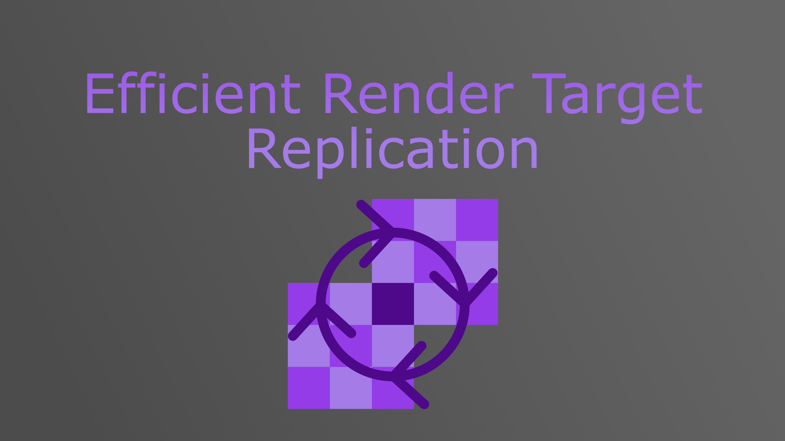
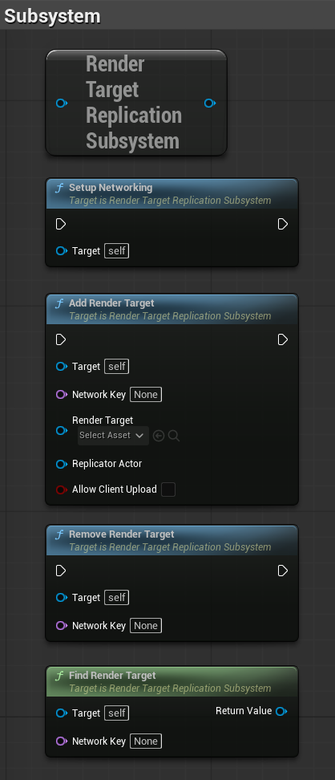
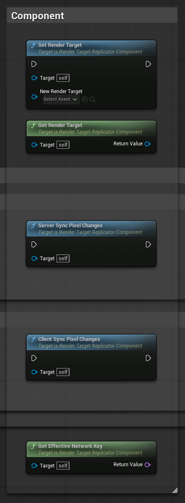
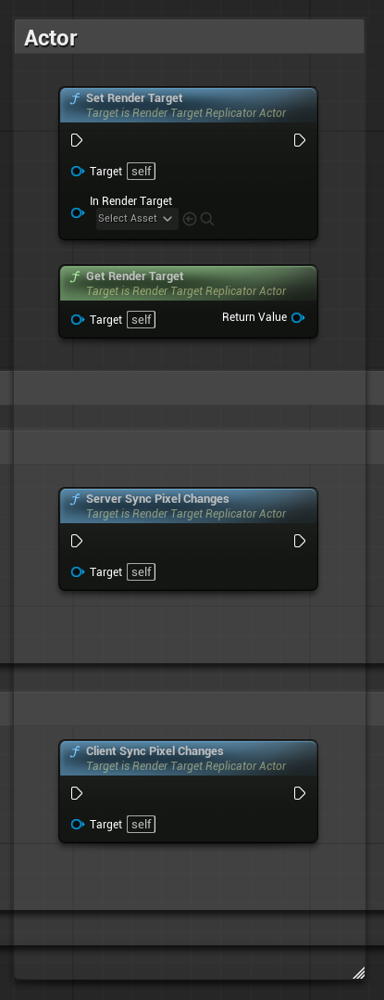
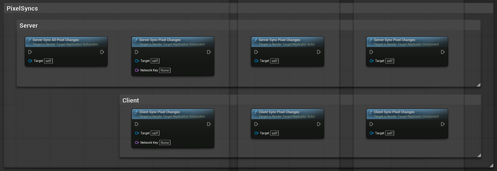
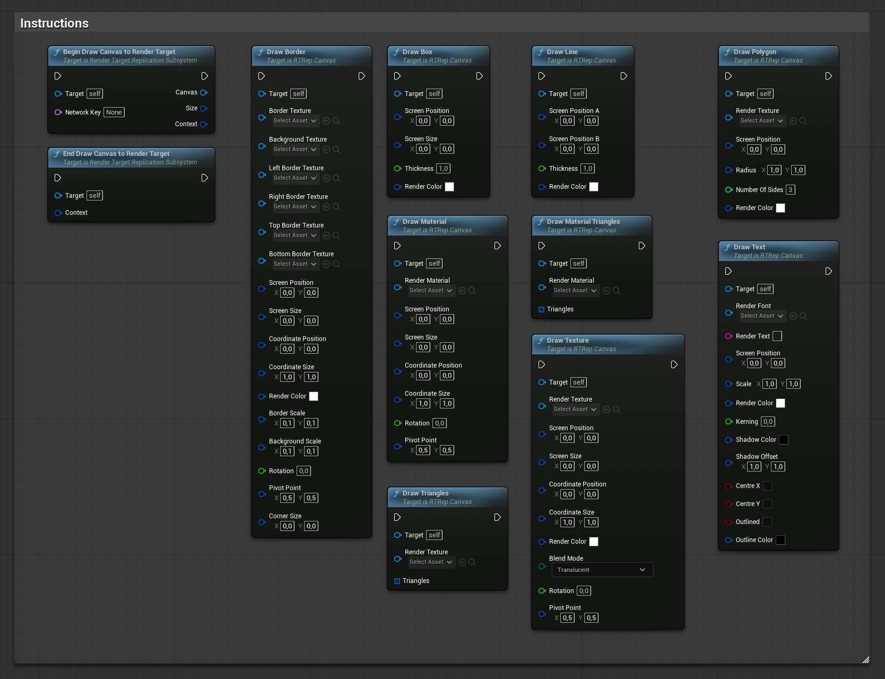
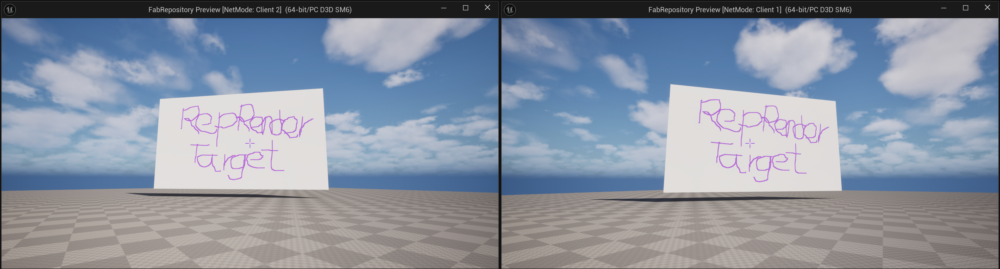
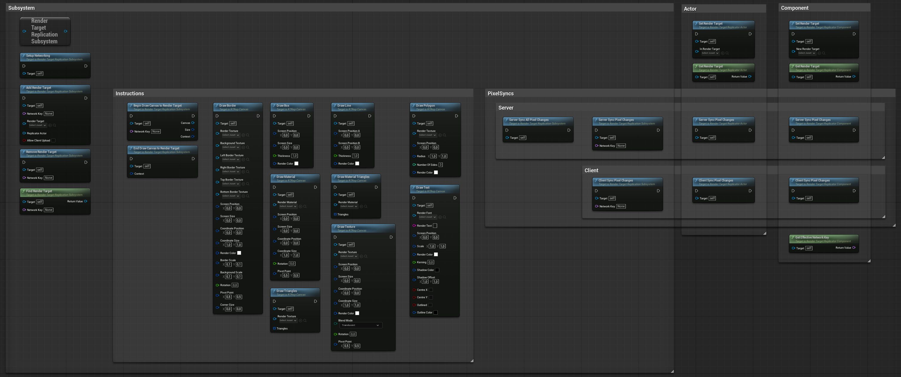

> **Version:** v1.0.0
> **Engine:** UE 5.5 - 5.7
> **Download:** [Fab Store](https://www.fab.com/listings/67e364d1-9f3e-4e4b-b8fe-8be3b8573142)

---

## General

The Render Target Replication plugin provides a complete networking framework for sharing `UTextureRenderTarget2D` **pixel changes and draw instructions** between server and clients. It is designed for multiplayer applications that need to distribute dynamic textures with minimal bandwidth.

The system runs through a dedicated TCP socket layer. Server-side GPU readback, delta compression, and Oodle packet compression are performed asynchronously. No manual replication setup is required beyond registering your render target with the subsystem.

Install the plugin from the Fab Store and enable it in your project. Redistribution is strictly prohibited.

---

## Architecture

The plugin is built around a `UWorldSubsystem` that manages all networking and readback. Optional actor and component wrappers are provided for quick setup. A `URTRepCanvas` object records draw calls so they can be compressed and replayed remotely.

| Class | Type | Responsibility |
|------|------|----------------|
| URenderTargetReplicationSubsystem | UWorldSubsystem | Manages TCP sockets, GPU readback, compression, packet dispatch, and client baselines |
| ARenderTargetReplicatorActor | AActor | Ready-to-place replicated actor that hosts a ReplicatorComponent |
| URenderTargetReplicatorComponent | UActorComponent | Optional convenience component that registers a render target using a NetworkKey |
| URTRepCanvas | UObject | Wraps UCanvas and records draw calls into a serializable instruction buffer |

---

## Subsystem Setup

The subsystem initializes automatically when the world begins play if `bAutoSetup` is `true`. Otherwise, call `SetupNetworking()` manually from your GameMode or level Blueprint.

On the server, this creates a non-blocking TCP listen socket on `BasePort` (default `7787`). On clients, it discovers the server IP from the active `NetConnection` and initiates a client socket.



| Property | Default | Description |
|----------|---------|-------------|
| BasePort | 7787 | TCP port for the listen socket |
| SocketBufferSize | 33554432 | OS-level send/receive buffer in bytes |
| bAutoSetup | false | Automatically initialize on world begin play |

---

## Registering a Render Target

You can use the subsystem directly without any actor component:

```cpp
URenderTargetReplicationSubsystem* Sub = World->GetSubsystem<URenderTargetReplicationSubsystem>();
Sub->AddRenderTarget(FName("MyKey"), MyRenderTarget, MyActor, false);
```

Alternatively, add a `URenderTargetReplicatorComponent` to any actor that owns a `UTextureRenderTarget2D`.



| Property | Description |
|----------|-------------|
| RenderTarget | The texture to replicate |
| NetworkKeyOverride | Manual FName key. If empty, the auto-generated `ReplicationId` is used |
| bAllowClientUpload | If true, clients may push pixel data for this target back to the server |

When the component begins play, it registers itself with the subsystem. If `NetworkKeyOverride` is empty, the server generates a unique `FGuid` (replicated to clients) and uses it as the network key.

---

## Render Target Replicator Actor

Place `ARenderTargetReplicatorActor` in your level or spawn it at runtime. It hosts a `URenderTargetReplicatorComponent` and exposes Blueprint-callable sync functions.



You can assign a render target directly to the actor, or let the internal component reference one from its owner.

---

## Pixel Synchronization

Call `Server_SyncPixelChanges` on the authority to initiate a GPU readback for a specific key. The subsystem schedules an async readback. Once the render-thread fence completes, the raw bytes are handed off to a background compression task and then are distrubuted to all relavent clients.



---

## Delta Compression

When a previous frame baseline exists for a given client, the system runs a `16x16` block diff between the current and previous frames. Only changed blocks are packed into a `DeltaSync` packet. If no deltas are found, the packet is dropped.

If no baseline exists, or if the client has not yet received a full frame, the system sends a `FullSync` packet instead. Clients are promoted to baseline-synced once they acknowledge a `FullSync`.

---

## Client Upload

Enable `bAllowClientUpload` on the replicator component or pass `true` to `AddRenderTarget` Clients can then call `Client_SyncPixelChanges` which performs a local GPU readback and transmits a `ClientUpload` packet to the server. The server applies the upload directly to its own render target and rebroadcast it. Client draw instructions are automatically uploaded to the server by calling `EndDrawCanvasToRenderTarget`.

---

## Net Cull Distance

The subsystem respects the owning actor's `NetCullDistanceSquared`. Clients inside range (called relevant clients) receive `FullSync` or `DeltaSync` packets. Clients outside range are skipped entirely. Clients that leave range have their baseline invalidated and must receive a new `FullSyn`c before deltas resume.

---

## Canvas Drawing & Instruction Replication

Instead of replicating raw pixels, you can replicate Canvas draw instructions. This is dramatically cheaper and supports materials, fonts, and textured primitives.

Use the subsystem's `BeginDrawCanvasToRenderTarget` and `EndDrawCanvasToRenderTarget` pair. Between these calls, the returned `URTRepCanvas` records every draw command into a compressed buffer. Make sure to call them within the same frame.



**Supported Canvas Operations:**
- DrawLine
- DrawTexture
- DrawMaterial
- DrawText
- DrawBorder
- DrawBox
- DrawTriangle
- DrawMaterialTriangle
- DrawPolygon

When `EndDrawCanvasToRenderTarget` is called, the instruction buffer is compressed and dispatched. On the server, it broadcasts to all connected relevant clients. On a client, it sends to the server which then broadcasts it.

---

##  Stability After Joining

The replication pipeline is fully stable after joining. Late-joining clients automatically receive a `FullSync` baseline before any `DeltaSync` or canvas instructions are applied, ensuring they catch up to the current world state without manual intervention or visible corruption.

---

## Demo Level

A complete working example is provided in `Content/Demo/L_RenderTargetReplicationDemo`.



The demo level contains four drawing whiteboards placed in the world. Both the server and clients can paint on the panels by moving their crosshair over a whiteboard. Drawing is replicated in real time via canvas draw instructions, while a slower background interval sends delta pixel syncs to reconcile any missed strokes and prevent long-term inconsistency.

This showcases the hybrid replication model: lightweight instruction packets keep the experience responsive, while periodic pixel deltas guarantee that every client eventually converges to the exact same texture.

---

## API Reference



### Subsystem

| Function | Description |
| -------- | ----------- |
| `SetupNetworking()` | Initializes the listen socket (server) or client connection (client) |
| `AddRenderTarget(Key, RT, Actor, bAllowUpload)` | Registers a render target for replication |
| `RemoveRenderTarget(Key)` | Unregisters and cleans up readback state |
| `FindRenderTarget(Key)` | Returns the registered UTextureRenderTarget2D |
| `Server_SyncPixelChanges(Key)` | Server: initiates readback and sync for one target |
| `Server_SyncAllPixelChanges()` | Server: syncs all registered targets |
| `Client_SyncPixelChanges(Key)` | Client: initiates upload readback for one target |
| `BeginDrawCanvasToRenderTarget(Key, Canvas, Size, Context)` | Begins recorded canvas drawing |
| `EndDrawCanvasToRenderTarget(Context)` | Ends drawing and dispatches instructions |

---

### Replicator Component

| Function | Description |
| -------- | ----------- |
| `Server_SyncPixelChanges()` | Convenience: calls subsystem Server_SyncPixelChanges |
| `Client_SyncPixelChanges()` | Convenience: calls subsystem Client_SyncPixelChanges |
| `SetRenderTarget(RT)` | Sets the target texture |
| `GetRenderTarget()` | Returns the target texture |
| `GetEffectiveNetworkKey()` | Returns NetworkKeyOverride or ReplicationId as FName |

---

### Replicator Actor

| Function | Description |
| -------- | ----------- |
| `SetRenderTarget(RT)` | Sets the render target on the internal component |
| `GetRenderTarget()` | Returns the current render target from the internal component |
| `Server_SyncPixelChanges()` | Convenience: forwards to the internal component's server sync |
| `Client_SyncPixelChanges()` | Convenience: forwards to the internal component's client upload |

---

### RTRepCanvas

| Function | Description |
| -------- | ----------- |
| `DrawLine(A, B, Thickness, Color)` | Records a line draw |
| `DrawTexture(Tex, Pos, Size, UVPos, UVSize, Color, Blend, Rot, Pivot)` | Records a textured quad |
| `DrawMaterial(Mat, Pos, Size, UVPos, UVSize, Rot, Pivot)` | Records a material quad |
| `DrawText(Font, Text, Pos, Scale, Color, Kerning, ...)` | Records text |
| `DrawBorder(...)` | Records a 9-slice border |
| `DrawBox(Pos, Size, Thickness, Color)` | Records a box |
| `DrawTriangle(Tex, Triangles)` | Records UV triangles |
| `DrawMaterialTriangle(Mat, Triangles)` | Records material triangles |
| `DrawPolygon(Tex, Pos, Radius, Sides, Color)` | Records a regular polygon |