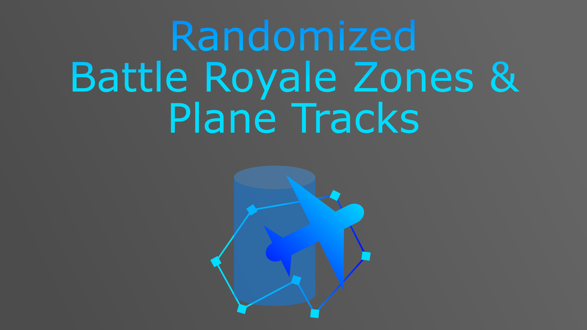
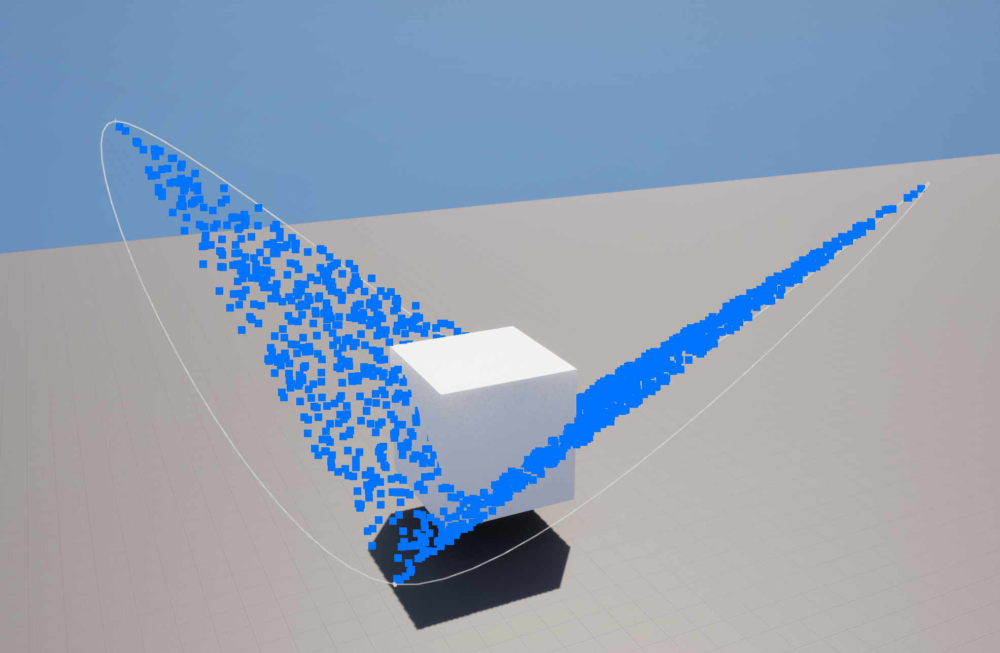
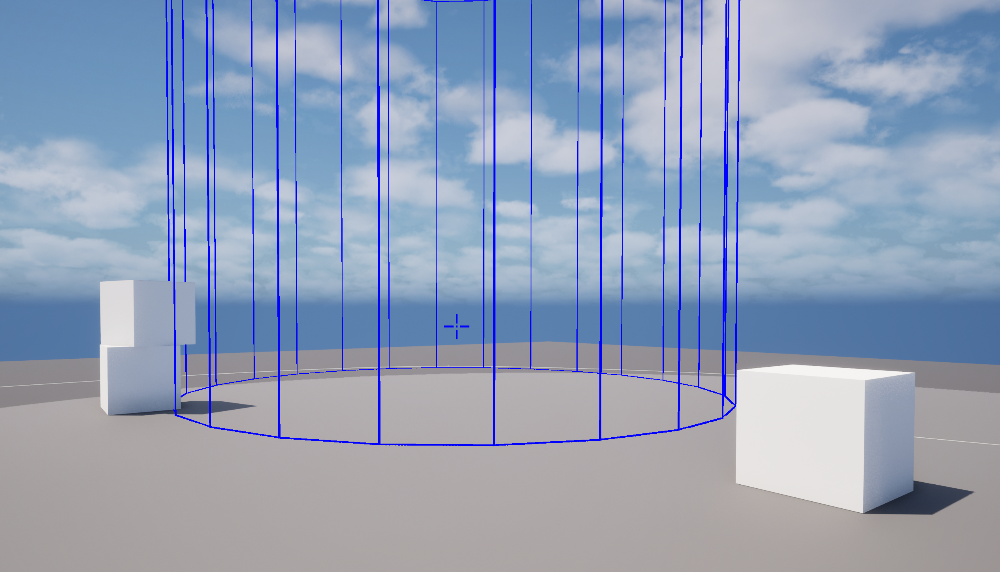
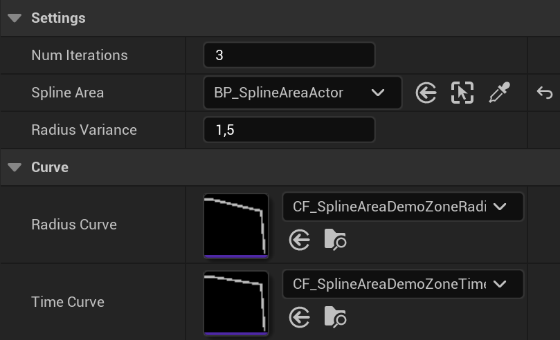
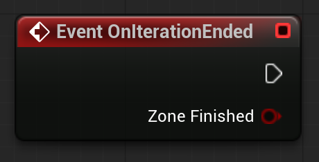
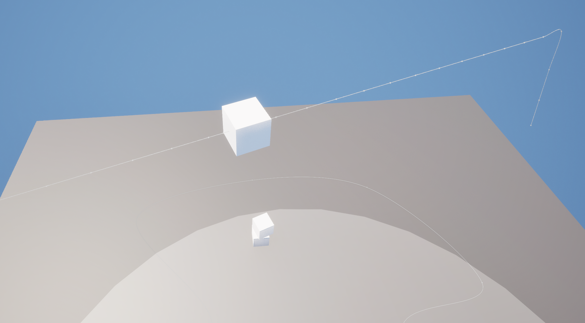
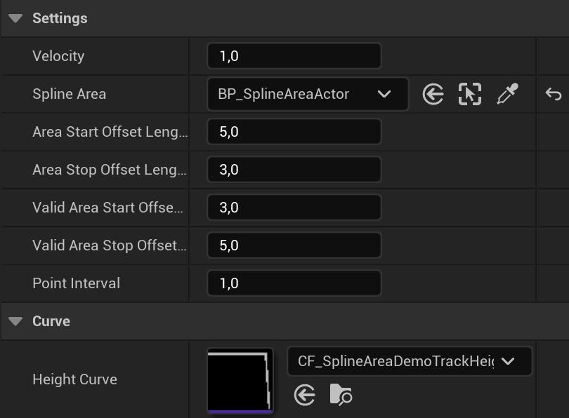
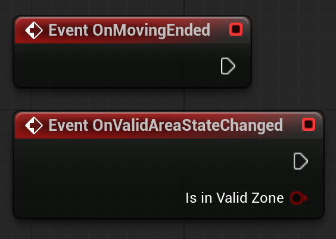
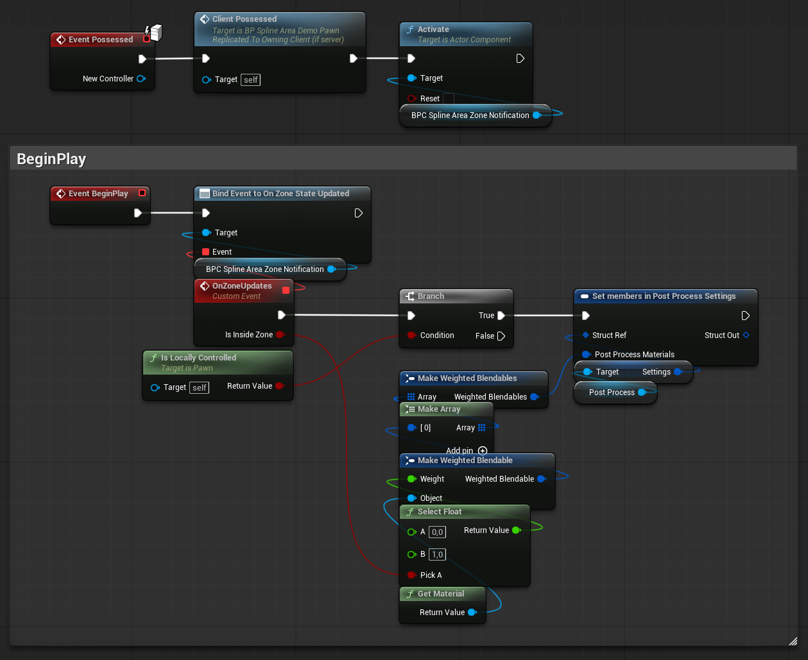
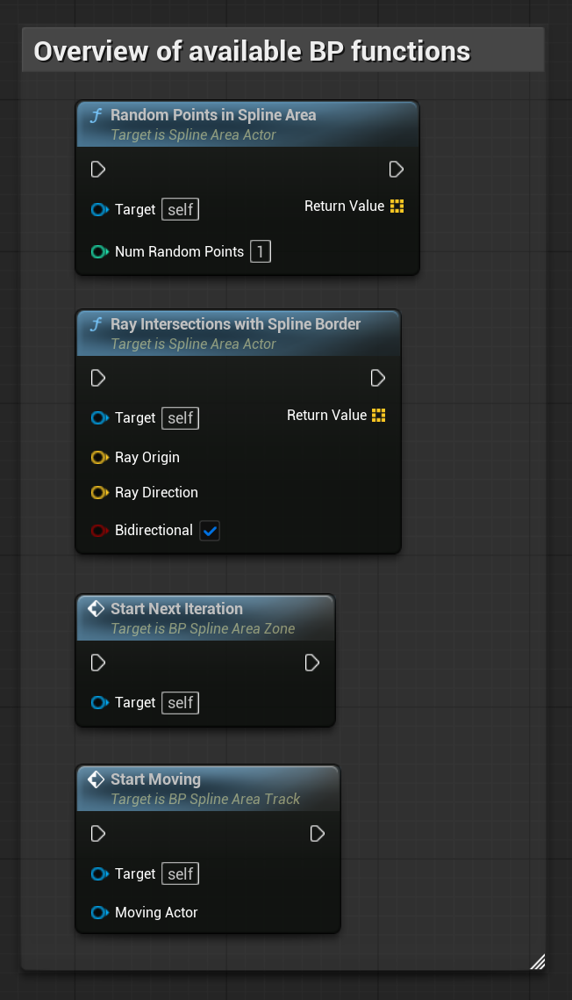

> **Version:** v1.0.0
> **Engine:** UE 5.7
> **Download:** [Fab Store](https://www.fab.com/listings/d9bb3ac9-8554-42be-89d0-750668ae587e)

---

## General

The Spline Area System plugin provides a complete framework for spline-defined play areas with automatic shrinking zone generation and randomized plane track generation. A `ASplineAreaActor` defines the map boundary using a closed spline. From that boundary, a zone system generates and animates a configurable series of shrinking circles, while a separate plane track system generates randomized flight paths across the area. Both systems are fully Blueprint-overridable through events.

The plugin is designed to be self-contained and drop-in. Assign a spline area, configure curves and settings, and the systems run independently. No C++ subclassing is required for customization - override events in Blueprint to add project-specific logic at any point.

Install the plugin from the Fab Store and enable it in your project. Redistribution is strictly prohibited.

---

## Architecture

The plugin is built around one C++ actor that provides the spline area geometry, and several Blueprint actors and a component that implement zone generation, plane track generation, and zone overlap detection on top of it.

| Class | Type | Role |
|---|---|---|
| `ASplineAreaActor` | C++ Actor | Closed spline boundary - generates random points and ray intersections |
| `BP_SplineAreaZone` | Blueprint Actor | Shrinking zone - generates, animates, and broadcasts zone events |
| `BP_SplineAreaTrack` | Blueprint Actor | Plane track - generates a randomized flight path across the spline area |
| `BP_SplineAreaZoneNotificationComponent` | Blueprint Component | Notifies the owning actor when entering or leaving the valid zone |

---

## SplineAreaActor

`ASplineAreaActor` is the foundation of the system. Place one in your level and shape the closed spline to define your map boundary. All other actors reference this spline area.

**`RandomPointsInSplineArea(NumRandomPoints)`** - Returns a set of uniformly distributed random points inside the spline boundary.

**`RayIntersectionsWithSplineBorder(RayOrigin, RayDirection, bBidirectional)`** - Returns all intersection points between a ray and the spline border. Set `bBidirectional` to `true` to test intersections in both directions along the ray.

Both functions handle non-horizontal spline placement automatically, so the area can sit on sloped terrain without any extra setup.

The `ASplineAreaActor` is not limited to battle royale. Any system that needs random positions inside a user-defined area - NPC scatter, loot spawning, procedural foliage, patrol zone generation - can reference the same actor.

---

## Zone System

`BP_SplineAreaZone` generates a series of shrinking zone circles that move inward across multiple iterations. Place one in your level, assign the Spline Area reference, and configure the settings and curves.

Configure the number of iterations and the radius variance to control how many shrink passes run and how much randomness is applied to each circle's size. The two curves shape the radius and the timing of each pass independently.

### Zone Settings

| Property | Description |
|---|---|
| **Num Iterations** | Number of shrink passes to run |
| **Spline Area** | Reference to the `ASplineAreaActor` defining the map boundary |
| **Radius Variance** | Random variation applied to each zone circle's size per iteration |
| **Radius Curve** | Float curve controlling the zone circle radius over shrink progress |
| **Time Curve** | Float curve controlling the timing and speed profile of the shrink movement |

### Zone Events & Variables

| Event | Provides | Description |
|---|---|---|
| `StartNextIteration` | `Iteration Index` | Fires when a new shrink iteration begins |
| `OnIterationEnded` | `Zone Finished` | Fires when an iteration completes |

Two Blueprint-readable variables are available at any time:

| Variable | Type | Description |
|---|---|---|
| `IterationTransforms` | Transform | The transforms generated for the current iteration |
| `IterationIndex` | Integer | The index of the currently running iteration |

Override `StartNextIteration` to react when a new circle begins — update UI, play a sound, or trigger a game event. Override `OnIterationEnded` and read `Zone Finished` to detect when all passes have completed.

---

## Plane Track System

`BP_SplineAreaTrack` generates a randomized plane flight path across the spline area. Place one in the level, assign the Spline Area reference, and configure the settings.

The offset settings control where the plane begins and ends its pass relative to the boundary, and define the valid drop window inside the map area. The height curve shapes the altitude profile along the track.

### Track Settings

| Property | Description |
|---|---|
| **Velocity** | Movement speed of the plane along the track |
| **Spline Area** | Reference to the `ASplineAreaActor` defining the flight boundary |
| **Area Start Offset Length** | How far before the map polygon the plane begins its approach. For example, `5.0` starts the plane 5 meters outside the boundary. |
| **Area Stop Offset Length** | How far before the far polygon edge the plane ends its pass. |
| **Valid Area Start Offset** | Distance inside the map polygon at which the valid drop zone begins. For example, `3.0` opens the drop window 3 meters inside the boundary. |
| **Valid Area Stop Offset** | Distance from the far boundary edge at which the drop zone ends. For example, `5.0` closes the drop window 5 meters before the plane exits the map. |
| **Point Interval** | Spacing between generated points on the track path |
| **Height Curve** | Float curve controlling the flight height of the plane along the track |

### Track Lifecycle Events

`BP_SplineAreaTrack` exposes Blueprint override events at key points in the track lifecycle.

| Event | Fires When |
|---|---|
| `OnMovingEnded` | The plane finishes traveling the current track segment |
| `OnValidAreaStateChanged` | The plane enters or exits the valid drop zone during its flight |

Override these in a Blueprint subclass to trigger gameplay logic - spawn drops, play audio, update UI - at the right moment in the flight path.

---

## Zone Notification Component

`BP_SplineAreaZoneNotificationComponent` tracks whether its owning actor is inside or outside the valid zone. Attach it to any pawn or actor that needs to respond to zone boundaries - a player character, a vehicle, an AI agent.

Bind to the `OnValidAreaStateChanged` event in Blueprint to drive damage ticking, warning UI, screen effects, or audio cues whenever the owning actor crosses the zone border.

---

## Demo Level

A complete working example is provided in `Content/Demo/L_SplineAreaZonesDemo`.

The demo includes:

- A closed `ASplineAreaActor` shaped to cover the demo terrain, used as the shared map boundary by both zone and track systems.
- A fully configured `BP_SplineAreaZone` running a multi-iteration shrink sequence with animated zone walls.
- A fully configured `BP_SplineAreaTrack` generating randomized plane passes with a visible demo plane mesh traveling the generated path.
- A playable character with `BP_SplineAreaZoneNotificationComponent` attached, providing live on-screen visual feedback when the player exits the zone.
- Simple game management Blueprint logic reacting to zone iteration end and plane track completion events.

Inspect the demo Blueprint actors for annotated examples of every override event, curve assignment, and settings value.

---

## API Reference

### ASplineAreaActor

| Function | Description |
|---|---|
| `RandomPointsInSplineArea(NumRandomPoints)` | Returns uniformly distributed random points inside the spline boundary |
| `RayIntersectionsWithSplineBorder(Origin, Direction, bBidirectional)` | Returns all intersections between a ray and the spline border |

### BP_SplineAreaZone - Key Properties

| Property | Description |
|---|---|
| `Spline Area` | Map boundary reference |
| `Num Iterations` | Number of shrink passes to run |
| `Radius Variance` | Per-iteration circle size randomization |
| `Radius Curve` | Zone circle radius profile over shrink progress |
| `Time Curve` | Shrink timing and speed profile |

### BP_SplineAreaTrack - Key Properties

| Property | Description |
|---|---|
| `Velocity` | Plane movement speed along the track |
| `Spline Area` | Map boundary reference |
| `Area Start / Stop Offset Length` | Approach and exit offsets relative to the boundary |
| `Valid Area Start / Stop Offset` | Drop zone window offsets inside the map area |
| `Point Interval` | Track path point spacing |
| `Height Curve` | Flight height profile along the track |