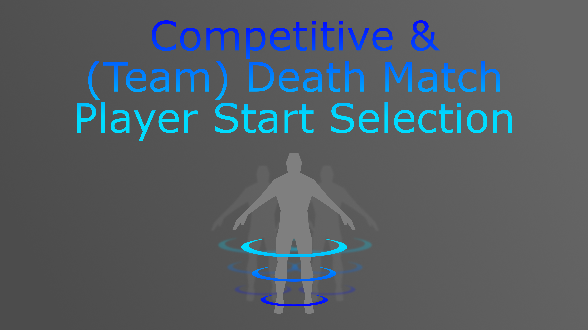
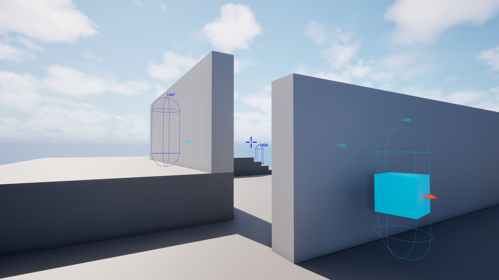

> **Version:** v1.0.0
> **Engine:** UE 5.5 - 5.7
> **Download:** [Fab Store](https://www.fab.com/listings/f0efdd9e-3440-4a99-879e-36d1986912e9)

---

## General

The Team Spawn System is an Unreal Engine plugin that provides a scoring-based player start selection framework for competitive and team-based game modes. Instead of picking a spawn point arbitrarily, the component evaluates every eligible `APlayerStart` in the level and scores it against three independent criteria: distance from enemies, look-at angle awareness, and spawn variety cycling. The highest-scoring point wins.

The system is interface-driven. It reads team IDs and alive states from your existing Controller and PlayerStart classes through two lightweight Blueprint interfaces, requiring no base class changes.

Install the plugin from the Fab Store and enable it in your project. Redistribution is strictly prohibited.

---

## Architecture

The plugin is built around one `UActorComponent` subclass, two Blueprint interfaces, and a supporting cycle struct. The component attaches to your `AGameModeBase` subclass and replaces the standard `ChoosePlayerStart` logic.

| Class / Interface | Role |
|---|---|
| `UTeamSpawnComponent` | Actor component - scores and returns ranked player starts |
| `ITeamSpawnPlayerControllerInterface` | Implement on your Controller - exposes team ID and alive state |
| `ITeamSpawnPlayerStartInterface` | Implement on your PlayerStart - exposes team ID |
| `FTeamSpawnPlayerStartCycle` | Internal struct - tracks per-player spawn history for variety scoring |

---

## Component Setup

Add `UTeamSpawnComponent` to your `AGameModeBase` subclass.


The component does not hook into `ChoosePlayerStart` automatically. Call `ChooseControllerPlayerStart` from your Game Mode's `ChoosePlayerStart` override, take the first key from the returned map (highest score), and return it as the chosen start.

```cpp
APlayerStart* AMyGameMode::ChoosePlayerStart_Implementation(AController* Player)
{
    TMap<APlayerStart*, float> Scores = TeamSpawnComponent->ChooseControllerPlayerStart(Player, nullptr);
    if (Scores.Num() > 0)
    {
        const APlayerStart* PlayerStart = Scores.CreateIterator().Key();
        // TeamSpawnComponent->RegisterControllerPlayerStartCycle(Player, PlayerStart);
        return PlayerStart;
    }
    return Super::ChoosePlayerStart_Implementation(Player);
}
```

After a player actually spawns, call `RegisterControllerPlayerStartCycle` with the chosen start to record it in the cycle history.

---

## Interfaces

The component reads team and alive data through two interfaces. Implement them on your own classes - no base class change is required.

### ITeamSpawnPlayerControllerInterface

Implement on your `APlayerController` or `AController` subclass.

| Function | Return | Description |
|---|---|---|
| `GetTeamId()` | `int32` | The team this controller belongs to. Return `-1` for no team. |
| `GetIsAlive()` | `bool` | Whether this controller's pawn is currently alive and should count as a threat. |

### ITeamSpawnPlayerStartInterface

Implement on your `APlayerStart` subclass.

| Function | Return | Description |
|---|---|---|
| `GetTeamId()` | `int32` | The team this spawn point belongs to. Return `-1` for neutral. |

If a Controller or PlayerStart does not implement the relevant interface, the component treats its team ID as `-1`. This means the plugin works out of the box even without the interfaces - team filtering simply has no effect until you implement them.

---

## Settings


### Look At

**LookAtConeAngle** - Half-angle of the forward cone (in degrees) within which an enemy is considered to be looking toward a spawn point. Enemy pawns facing within this cone toward a candidate start penalise it. Default: `30.0`.

**LookAwayAngleReward** - Score added per degree that a spawn point falls outside an enemy's look-at cone. Higher values make the system more strongly prefer spawns that are behind enemies. Default: `4.0`.

### Distance

**DistanceMeterReward** - Score added per metre of distance between an enemy pawn and a candidate spawn point, up to `MaxMeterDistanceReward`. Higher values make the system strongly prefer spawning far from enemies. Default: `10.0`.

**MaxMeterDistanceReward** - Distance cap in metres beyond which additional separation no longer increases the score. Prevents extremely distant but poor spawns from dominating. Default: `150.0`.

**PlayerStartBlockingPunishment** - Score penalty applied when a spawn point is blocked by geometry but a valid teleport spot can still be found nearby. Points that are fully blocked with no valid teleport spot are excluded entirely. Default: `1500.0`.

### Variety

**CycleReward** - Score bonus proportional to how many spawns ago this point was last used by the same player. A point never used scores the maximum cycle bonus; a point used last spawn scores the minimum. Default: `50.0`.

### Team

**bRespectPlayerTeam** - When `true`, pawns on the same team as the spawning player are ignored when computing distance and look-at scores. Enable for team death match; disable for free-for-all. Default: `true`.

**bRespectPlayerStartTeam** - When `true`, only `APlayerStart` actors whose team ID matches the spawning player's team ID are considered as candidates. Default: `true`.

---

## Customization


`GetCustomPlayerStartScore` is a `BlueprintNativeEvent`, meaning it can be overridden in either Blueprint or C++ without touching the component source.

```cpp
// C++ override example
float UMySpawnComponent::GetCustomPlayerStartScore_Implementation(APlayerStart* PlayerStart, float Score)
{
    // Penalise spawns inside a contested zone
    if (IsInContestedZone(PlayerStart->GetActorLocation()))
    {
        Score -= 500.0f;
    }
    return Score;
}
```

In Blueprint, override the event on a Blueprint subclass of `UTeamSpawnComponent` and return the modified score. The base score already incorporates all built-in distance, look-at, and cycle calculations.

---

## Spawn Cycle Registration

After the Game Mode selects and uses a spawn point, record it by calling `RegisterControllerPlayerStartCycle`. This updates the per-player cycle history used by the variety scoring in subsequent spawns.

```cpp
// Call this after RestartPlayer / SpawnDefaultPawnFor
TeamSpawnComponent->RegisterControllerPlayerStartCycle(Controller, ChosenPlayerStart);
```

For non-controller-based flows (bots with custom IDs, replay systems), use `RegisterIdPlayerStartCycle(PlayerCycleId, PlayerStart)` with any unique string identifier instead.

---

## Demo Level

A complete working example is provided in `Content/Demo/L_TeamSpawnSystemDemo`.



The demo includes:

- A Game Mode subclass with `UTeamSpawnComponent` attached and `ChoosePlayerStart` wired up.
- Multiple `APlayerStart` actors implementing `ITeamSpawnPlayerStartInterface` with different team IDs.
- A playable character implementing `ITeamSpawnPlayerControllerInterface` with configurable team assignment.
- Live debug output showing per-spawn-point scores.
- Multiple enemy pawns positioned to demonstrate how look-at avoidance and distance rewards redirect spawn selection in real time.

Inspect the Blueprint graphs in the demo assets for annotated examples of each integration point.

---

## API Reference


### UTeamSpawnComponent

| Function | Description |
|---|---|
| `ChooseControllerPlayerStart(Controller, PawnClass)` | Scores all eligible starts for a given Controller; reads team ID via interface |
| `ChooseTeamIdPlayerStart(TeamId, PawnClass, CycleId)` | Scores all eligible starts for a raw team ID and cycle key; useful for bots or custom flows |
| `RegisterControllerPlayerStartCycle(Controller, PlayerStart)` | Records a chosen start in the Controller's cycle history |
| `RegisterIdPlayerStartCycle(CycleId, PlayerStart)` | Records a chosen start by arbitrary string ID |
| `GetCustomPlayerStartScore(PlayerStart, Score)` | BlueprintNativeEvent - override to inject custom per-start scoring logic |

### Properties

| Property | Type | Default | Description |
|---|---|---|---|
| `LookAtConeAngle` | `float` | `30.0` | Forward cone half-angle (degrees) for enemy look-at detection |
| `LookAwayAngleReward` | `float` | `4.0` | Score per degree outside an enemy's look-at cone |
| `DistanceMeterReward` | `float` | `10.0` | Score per metre of separation from an enemy |
| `MaxMeterDistanceReward` | `float` | `150.0` | Distance cap in metres for distance scoring |
| `PlayerStartBlockingPunishment` | `float` | `1500.0` | Score penalty for partially blocked spawn points |
| `CycleReward` | `float` | `50.0` | Score bonus per spawn since this point was last used |
| `bRespectPlayerTeam` | `bool` | `true` | Ignore teammates when computing threat scores |
| `bRespectPlayerStartTeam` | `bool` | `true` | Only consider spawn points matching the player's team |