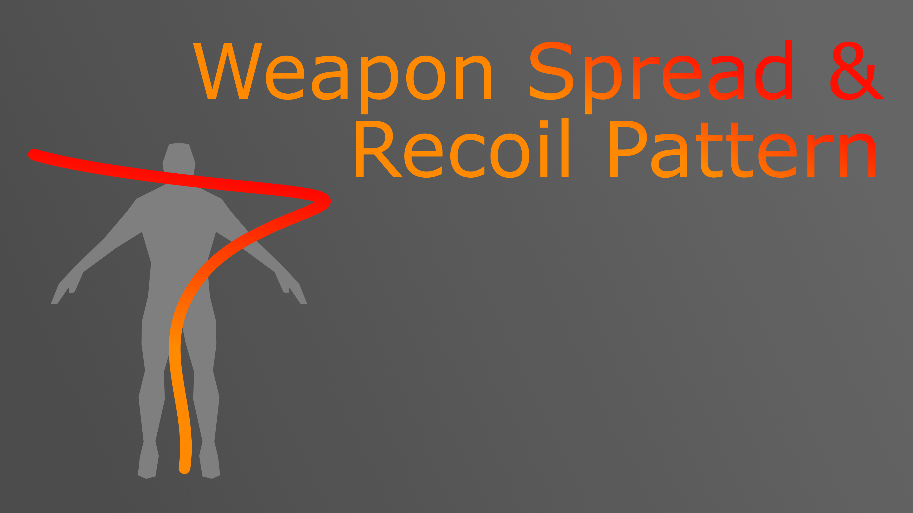
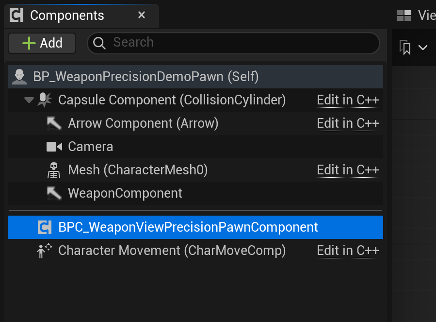
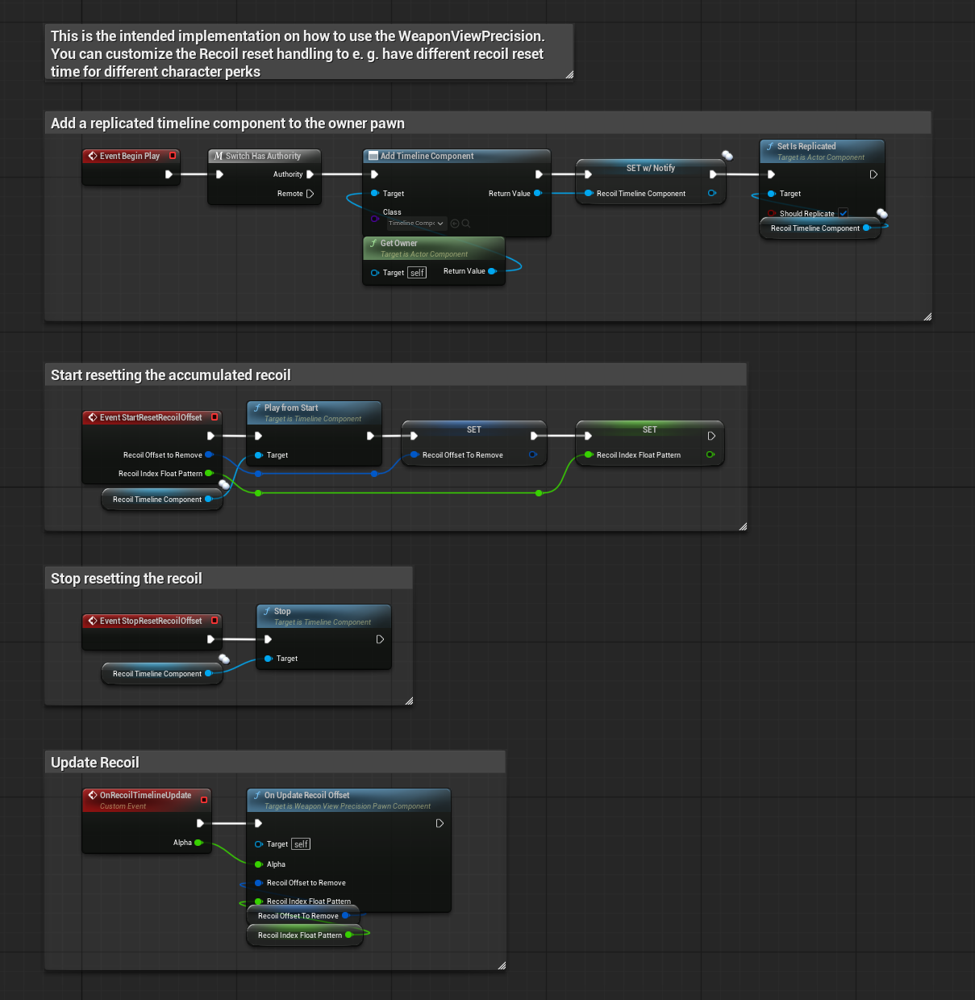
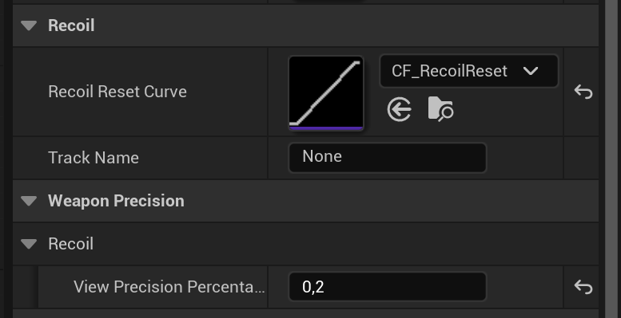
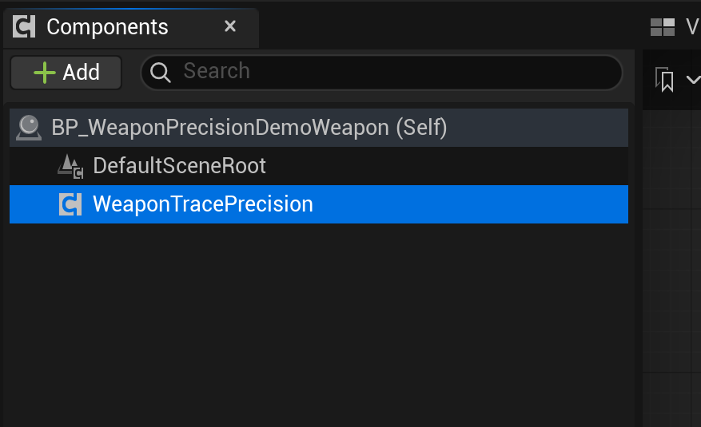
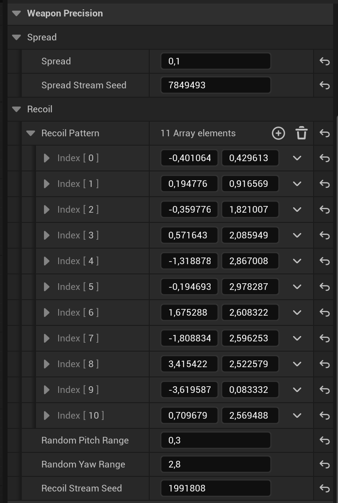
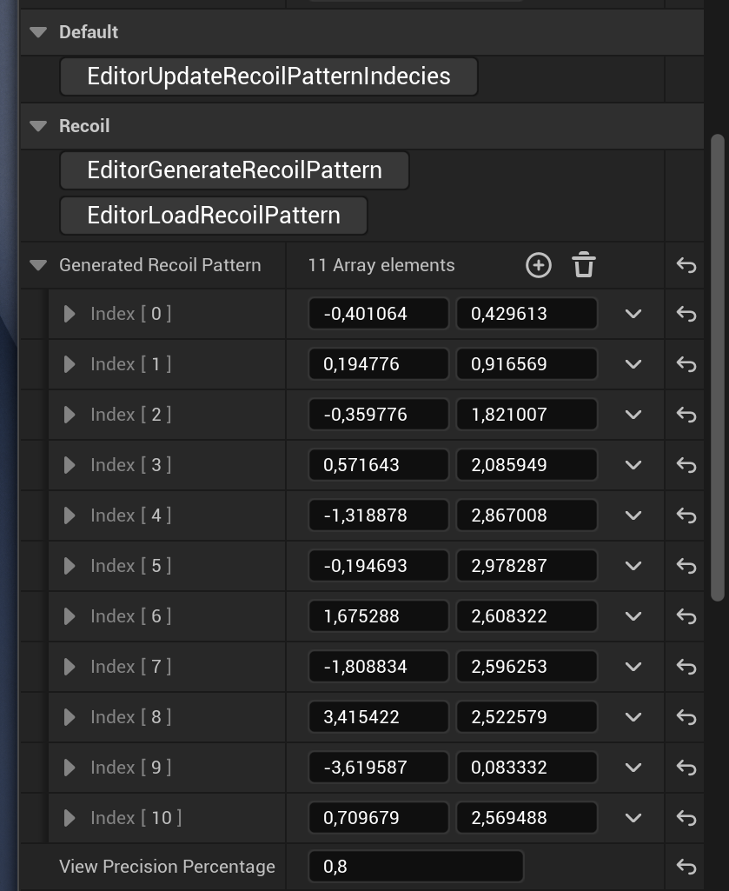
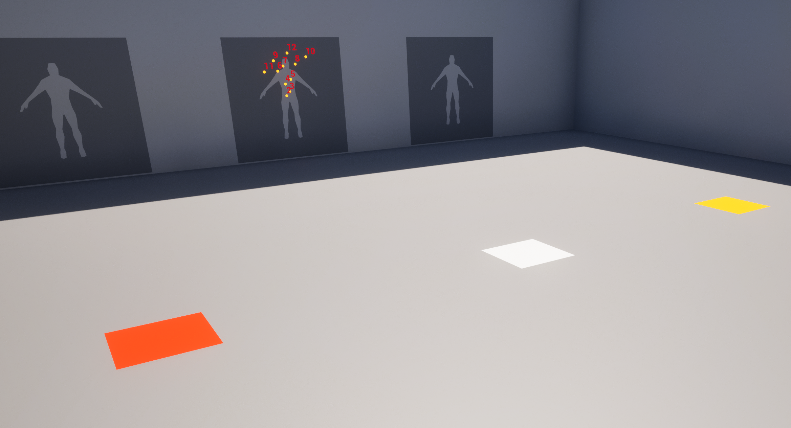
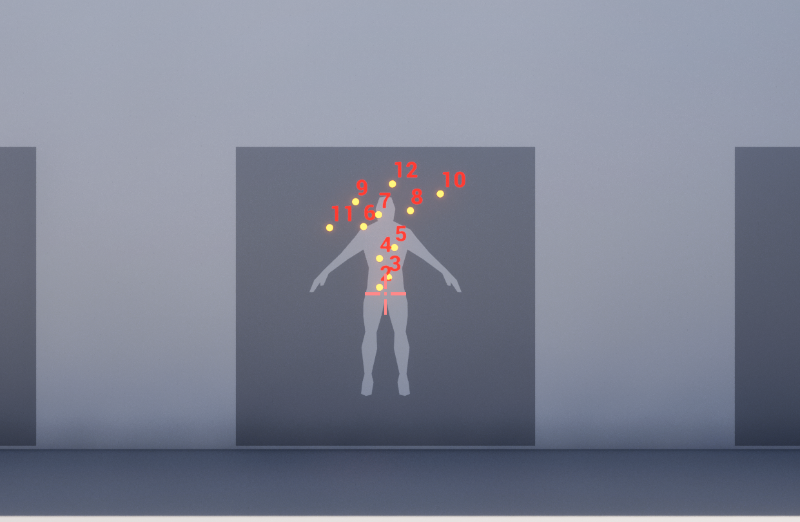
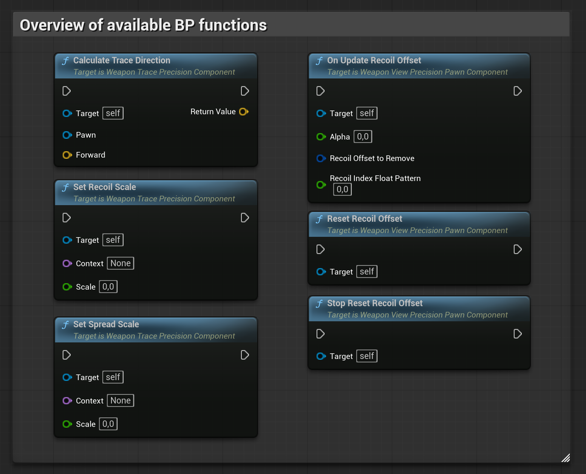

> **Version:** v1.0.0
> **Engine:** UE 5.7

---

## General

The Weapon Precision System is an Unreal Engine plugin that provides a replication-ready framework for two distinct but related aspects of shooter mechanics: the mathematical calculation of a projectile’s trace direction (Trace Precision) and the procedural visual feedback applied to the player’s camera (View Precision).

The system is fully multiplayer-compatible. Recoil calculations are server-authoritative, and visual feedback is delivered to the owning client via reliable RPCs. No manual networking setup is required.

Install the plugin from the Fab Store and enable it in your project. Redistribution is strictly prohibited.

---

## Architecture

The plugin is built around two UActorComponent subclasses that work in tandem. They are intentionally decoupled: the Trace component lives on the weapon and computes shot directions; the View component lives on the pawn and manages camera offsets.

| Class | Attached To | Responsibility |
|------|------------|----------------|
| UWeaponTracePrecisionComponent | Weapon Actor | Calculates final trace direction (spread + recoil) |
| UWeaponViewPrecisionPawnComponent | Player Pawn | Applies camera kick and manages recoil reset |

---

## Component Setup

### WeaponViewPrecisionPawnComponent

Add this component to your Player Pawn or Character.



The component handles two things: forwarding recoil offsets to the player controller (so the camera physically rotates) and tracking the accumulated recoil state so it can be smoothly reversed when the player stops firing.

The plugin ships a ready-to-use Blueprint implementation:  
BPC_WeaponViewPrecisionPawnComponent, located in Content/Core/. It provides a default recoil recovery implementation using a customizable curve asset. You may use this directly or subclass the C++ component for weapon-specific behaviour.



---

## Settings



ViewPrecisionPercentage - Controls what fraction of the computed recoil offset is applied as a camera rotation. A value of 0.5 means the camera moves half as far as the logical trace offset. The remainder is only applied to the trace ray, producing the classic effect where bullets go where the gun points, not exactly where the crosshair is.

Tip: You can layer additional camera shake effects on top of this component to add recoil feel independently of recoil accuracy. The two systems do not interfere.

---

## WeaponTracePrecisionComponent

Add this component to your Weapon Actor.



When a shot is fired, call CalculateTraceDirection(Pawn, Forward). Pass the owning pawn and the weapon’s forward vector. The function returns the final world-space direction for your line trace, already modified by the current spread and recoil state. Use this direction as the end point of your LineTraceSingleByChannel call.



---

## Spread

Spread - A symmetric random angular deviation (in degrees) applied independently on both axes per shot. This is stateless: each call draws a fresh random value from an internal FRandomStream, seeded by SpreadStreamSeed. The spread is purely additive noise with no pattern or recovery.

Use Spread for weapons that scatter by nature - shotguns, SMGs at long range, or any weapon where bullet deviation is not correlated across shots.

---

## Recoil Pattern

RecoilPattern - A `TArray<FVector2D>` where each element is a yaw/pitch angular offset (in degrees) applied on consecutive shots. The system iterates the array sequentially: shot 0 uses RecoilPattern[0], shot 1 uses RecoilPattern[1], and so on. Index 0 is conventionally set to (0, 0), making the first shot always travel exactly along the forward vector.

When the array is exhausted, the system switches to procedural crown recoil:


RandomYawRange / RandomPitchRange - Defines the bounds of the random offset applied once the RecoilPattern array is exhausted. This simulates the erratic top-of-pattern behaviour typical of automatic rifles in competitive shooters. The random values are drawn from a seeded FRandomStream (RecoilStreamSeed), so they are reproducible and deterministic.

Design guideline: Use RecoilPattern for weapons with a learnable, deterministic pattern. Use only Spread for weapons where deviation is random by design. Mixing both is supported but apply carefully - spread and recoil stack additively on each shot.

---

## Dynamic Scaling

Both spread and recoil can be scaled at runtime using a named context system:

```

WeaponTracePrecisionComponent->SetSpreadScale(FName("ADS"), 0.3f);
WeaponTracePrecisionComponent->SetRecoilScale(FName("ADS"), 0.6f);

```

Multiple contexts can be active simultaneously. All active scale values are multiplied together to produce the final scale factor. Removing a context by setting its scale to 1.0 effectively neutralises it.

Typical contexts:

| Context | Examples Trigger | Typical Scale |
|--------|-----------------|--------------|
| "ADS" | Player is aiming down sights | 0.2 – 0.5 |
| "Crouch" | Player is crouching | 0.7 – 0.9 |
| "Jump" | Player is airborne | 1.5 – 3.0 |
| "Move" | Player is moving above a threshold | 1.2 – 2.0 |

---

## Recoil Reset

When the player releases the fire input, call ResetRecoilOffset() on the UWeaponViewPrecisionPawnComponent. This triggers the Blueprint event K2_StartResetRecoilOffset, passing the accumulated offset and the current pattern index, replicated across weapon inventory.

In BPC_WeaponViewPrecisionPawnComponent, this event drives a timeline that interpolates the camera back toward its pre-fire position. At each tick, call OnUpdateRecoilOffset(Alpha, RecoilOffsetToRemove, RecoilIndexFloatPattern) with the current alpha from the timeline. The component interpolates both the trace-level RecoilOffset and the controller-level ControlRecoilOffset simultaneously.

To abort an in-progress reset (for example, if the player starts firing again), call StopResetRecoilOffset(), which triggers K2_StopResetRecoilOffset.

Note: The K2_ prefixed functions are Blueprint implementable events. The default implementation in BPC_WeaponViewPrecisionPawnComponent is suitable for most use cases. Override only if you need non-standard reset curves or conditional reset behaviour.

---

## Recoil Pattern Creator



The plugin includes in-editor tooling for authoring recoil patterns visually. The tools are located in Content/Core/Creator/.

BP_WeaponPrecisionStart - Place this actor in a level. It represents the crosshair / muzzle origin. The index labels on each target begin at 0, which corresponds to the first shot and is always at the crosshair position.

BP_WeaponPrecisionTarget - Place one of these for each shot in the pattern. Each actor represents one bullet impact. Position them in 3D space relative to the Start actor to define where each shot should land.

---

## Workflow: Creating a Pattern

1. Place BP_WeaponPrecisionStart and the desired number of BP_WeaponPrecisionTarget actors in a level.  
2. Arrange the targets to match your desired bullet spread shape.  
3. Select BP_WeaponPrecisionStart and click GenerateRecoilPattern in its details panel.  
4. Copy the generated FVector2D array output.  
5. Paste it into the RecoilPattern property of your UWeaponTracePrecisionComponent.  

---

## Workflow: Visualising an Existing Pattern

1. Paste an existing RecoilPattern array into BP_WeaponPrecisionStart.  
2. Click LoadRecoilPattern to spawn target actors at the correct positions.  
3. Use UpdateRecoilPatternIndices to refresh index labels after repositioning targets.  

---

## Multiplayer

The system follows a server-authoritative model with client-side visual feedback:

1. The owning client calls CalculateTraceDirection locally (on the weapon, which may run on any machine depending on your authority model).  

2. The computed RecoilOffset is sent to the server via Server_CalculateRecoilOffset (a reliable server RPC).  

3. The server applies ViewPrecisionPercentage and sends the scaled offset back to the owning client via Client_AddRecoilControllerInput (a reliable client RPC).  

4. The client adds the offset as controller input, rotating the camera.  

5. ControlRecoilOffsetToRemove is replicated to the owning client so that recoil recovery is correctly synchronised.  

No additional setup is required. Ensure the UWeaponViewPrecisionPawnComponent is added to a replicated actor (your Pawn or Character) and that SetIsReplicatedByDefault is respected, which it is by default.

---

## Demo Level

A complete working example is provided in Content/Demo/L_WeaponPrecisionSystemDemo.



The demo includes:

- A playable character with UWeaponViewPrecisionPawnComponent configured and a weapon with UWeaponTracePrecisionComponent attached.  
- A visualised recoil pattern authored with the Recoil Pattern Creator tools.  
- Modifier zones - trigger volumes that call SetSpreadScale and SetRecoilScale to demonstrate how dynamic context scaling affects precision in real time.  
- Reset logic - shows how to hook ResetRecoilOffset to the fire input release event.  



Inspect the Blueprint graphs in the demo assets for annotated examples of each integration point.

---

## API Reference



### Trace Component

| Function                                 | Description                    |
| ---------------------------------------- | ------------------------------ |
| `CalculateTraceDirection(Pawn, Forward)` | Returns final shot direction   |
| `SetSpreadScale(Context, Scale)`         | Adds/updates spread multiplier |
| `SetRecoilScale(Context, Scale)`         | Adds/updates recoil multiplier |

---

### View Component

| Function                    | Description              |
| --------------------------- | ------------------------ |
| `ResetRecoilOffset()`       | Starts recoil recovery   |
| `OnUpdateRecoilOffset(...)` | Called during recovery   |
| `StopResetRecoilOffset()`   | Aborts recovery          |
| `K2_StartResetRecoilOffset` | Implement recovery logic |
| `K2_StopResetRecoilOffset`  | Implement abort logic    |

