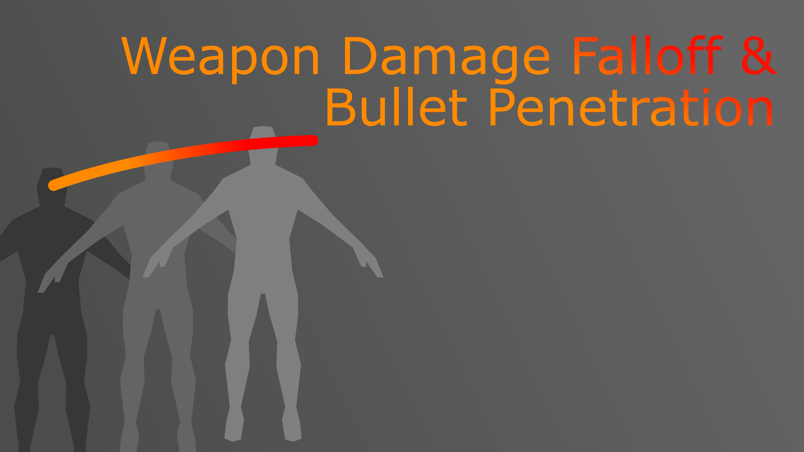

> **Version:** v1.0.0
> **Engine:** UE 5.5 - 5.7

---

## General

The Weapon Range Damage is an Unreal Engine plugin that provides a complete framework for realistic weapon damage calculation across distance and through surfaces. It handles multi-hit wall-penetration traces, distance-based damage falloff driven by a curve asset, and per-surface exponential falloff configured through a Data Table.

The system is designed to be self-contained and composable. A single component call returns a structured array of all hit results - front faces and back faces - each with their final calculated damage value already applied. No manual damage math is required.

Install the plugin from the Fab Store and enable it in your project. Redistribution is strictly prohibited.

---

## Architecture

The plugin is built around one UActorComponent subclass and two supporting data structures. The component performs the full multi-pass line trace and damage calculation pipeline; the structs carry the per-hit results back to the caller.

| Class / Struct | Role |
|---|---|
| `UWeaponTraceDamageComponent` | Actor component - performs traces and computes final damage |
| `FSurfaceFalloffStructure` | Data Table row - maps a Physical Material to a falloff coefficient |
| `FDamageHitResultStructure` | Return value - wraps a hit result with its computed damage and face flag |

---

## Component Setup

Add `UWeaponTraceDamageComponent` to your Weapon Actor.


The component requires two data assets to be assigned in its Details panel before `WeaponTrace` will produce results:

- **DamageRangeCurve** - a `UCurveFloat` whose X axis is distance in metres and Y axis is the base damage at that distance.
- **SurfaceFalloffDataTable** - a `UDataTable` using `FSurfaceFalloffStructure` as its row type, mapping each `UPhysicalMaterial` to its per-centimetre exponential falloff coefficient.

Both assets can be created manually in the Content Browser or generated at runtime via `CreateDamageRangeCurve`.

---

## Settings


**TracePrecision** - Offset in centimetres applied to the start of each subsequent trace pass to step past the previous impact point. Lower values are more precise but may clip geometry. Default is `10.0`.

**DamageRangeCurve** - The float curve that defines base damage as a function of travel distance. The X axis is read in metres (distance / 100). Assign a curve asset here or call `SetDamageRangeCurve` at runtime.

**SurfaceFalloffDataTable** - The Data Table that maps Physical Materials to falloff coefficients. Each row is an `FSurfaceFalloffStructure`. If a hit surface has no matching row, a falloff of `1.0` (no penetration loss) is assumed. If the hit provides no Physical Material, the engine default Physical Material is used as the lookup key.

---

## WeaponTrace

`WeaponTrace(Start, End, ActorsToIgnore, TraceChannel)` is the single entry point for a shot. It performs all passes internally and returns a `TArray<FDamageHitResultStructure>`.


Each `FDamageHitResultStructure` in the returned array contains:

| Field | Type | Description |
|---|---|---|
| `HitResult` | `FHitResult` | The raw engine hit result for this impact |
| `Damage` | `float` | Final computed damage at this impact point |
| `bIsBackside` | `bool` | `true` if this hit is the exit face of a penetrated object |

The array is ordered front-to-back along the trace. Process it in sequence and apply `Damage` to each hit actor via whichever damage system your project uses (raw `TakeDamage`, GAS, or a custom handler).

---

## Distance-Based Damage (Range Curve)

The `DamageRangeCurve` asset defines the base damage envelope over distance. The component samples it at each impact using:


Design the curve so that X = 0 is muzzle distance and Y is your desired damage at that range. A typical rifle curve starts flat and drops off steeply beyond effective range.

If the calculated damage after falloff deductions drops below `0.5`, the trace is terminated early - the bullet does not have enough energy to register further hits.

---

## Surface Penetration & Falloff

When a blocking hit is found, the system immediately attempts a reverse trace from the expected exit side to locate the back face of the geometry. If a back face is found, exponential falloff is calculated using the falloff coefficients of both the front and back Physical Materials:


The accumulated falloff is carried forward to all subsequent impacts. This means penetrating multiple surfaces compounds: a bullet that passes through concrete and then a thin wall will have significantly reduced damage on the far side of the second wall.

The `FSurfaceFalloffStructure` Data Table row has two fields:

| Field | Default | Description |
|---|---|---|
| `PhysicalMaterial` | - | The Physical Material to match against |
| `DamageFalloff` | `0.67` | Exponential base for falloff calculation (0–1; lower = more absorption) |

Surfaces not present in the table are treated as having a falloff of `1.0`, meaning they absorb no damage (fully penetrable by default). Set up rows only for surfaces that should resist penetration.

---

## Dynamic Scaling

Damage output, effective range, and falloff can each be scaled at runtime using a named context system. All scale maps are evaluated by multiplying every active entry together before the trace runs.

```cpp
WeaponTraceDamageComponent->SetDamageScale(FName("Suppressor"), 0.85f);
WeaponTraceDamageComponent->SetDamageRangeScale(FName("LongBarrel"), 1.2f);
WeaponTraceDamageComponent->SetFalloffScale(FName("ArmorPiercing"), 0.5f);
```

| Function | Affects | Typical Use |
|---|---|---|
| `SetDamageScale(Context, Scale)` | Overall damage multiplier | Attachments, buffs, damage states |
| `SetDamageRangeScale(Context, Scale)` | X axis of range curve lookup | Barrel length, ammo type |
| `SetFalloffScale(Context, Scale)` | Per-surface falloff exponent | Armor-piercing rounds, surface upgrades |

Multiple contexts can be active simultaneously. Set a context's scale back to `1.0` to effectively remove its influence.

---

## Damage Curve Creator


The plugin includes in-editor Blueprint tooling for designing and validating damage curves. The tools are located in `Content/Core/Creator/`.

`CreateDamageRangeCurve(CurvePoints, bSaveToDisk, AssetPath, AssetName)` - Builds a `UCurveFloat` from a `TArray<FVector2D>` of (Distance, Damage) pairs. When `bSaveToDisk` is `true`, the curve is saved as a persistent Content Browser asset at the specified path. When `false`, a transient curve is returned for runtime use.

---

## Demo Level

A complete working example is provided in `Content/Demo/L_WeaponRangeDamageDemo`.


The demo includes:

- A playable character with `UWeaponTraceDamageComponent` configured on the weapon actor.
- A set of geometry objects with different Physical Materials assigned, each with a corresponding row in the Surface Falloff Data Table.
- Live debug output showing per-hit damage values, falloff coefficients, and accumulated reduction as the player fires through different surface combinations.
- Example Blueprint graphs demonstrating how to call `WeaponTrace`, iterate the returned array, and dispatch damage to hit actors.
- Modifier zones - trigger volumes to demonstrate how dynamic context scaling affects damage in real time.

Inspect the Blueprint graphs in the demo assets for annotated examples of each integration point.

---

## API Reference


### WeaponTraceDamageComponent

| Function | Description |
|---|---|
| `WeaponTrace(Start, End, ActorsToIgnore, TraceChannel)` | Performs the full multi-pass trace and returns all damage hit results |
| `SetDamageScale(Context, Scale)` | Adds or updates an overall damage multiplier for the given context |
| `SetDamageRangeCurve(Curve)` | Assigns the range curve at runtime |
| `SetDamageRangeScale(Context, Scale)` | Adds or updates a range (X axis) multiplier for the given context |
| `SetFalloffScale(Context, Scale)` | Adds or updates a falloff exponent multiplier for the given context |
| `CreateDamageRangeCurve(Points, bSaveToDisk, Path, Name)` | Creates a curve asset from point pairs; optionally saves to Content Browser |

### Properties

| Property | Type | Description |
|---|---|---|
| `TracePrecision` | `float` | Step offset (cm) between trace passes; default `10.0` |
| `DamageRangeCurve` | `UCurveFloat*` | Damage-over-distance curve asset |
| `SurfaceFalloffDataTable` | `UDataTable*` | Physical Material → falloff coefficient table |